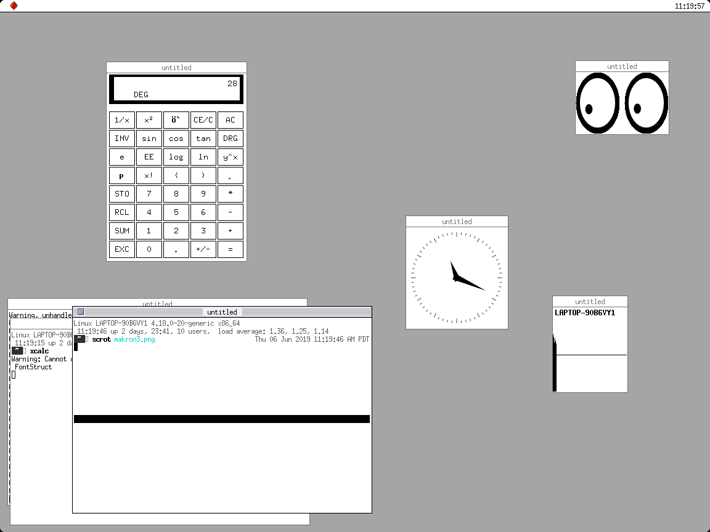

# makron
hi! this is my window manager. it's still under development.

i started it a few years ago because i couldn't find a window manager that
did what i wanted, and now i have a window manager that doesn't do what i want.

i'm working on rewriting and expanding it so that it works for me.

it has bare minimum levels of functionality, so you are free to try it out.

requires [libsulfur](https://github.com/goshhhy/libsulfur).

screenshots
===========

